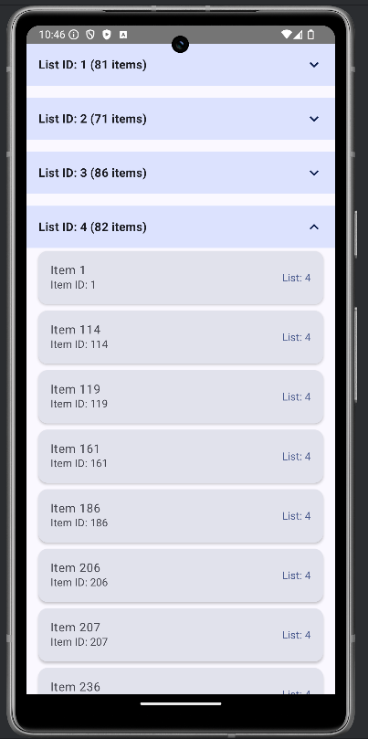

# "I'm not going to name the company to maintain privacy" Coding Exercise - Android App

## Overview

This Android application was developed as part of "This Company's" coding challenge. It retrieves data from a provided API endpoint, processes it according to specific requirements, and displays the results in an organized, user-friendly interface.

## Features

- **Data Retrieval**: Fetches JSON data from "The Company's" hiring API endpoint
- **Data Processing**: 
  - Filters out items with null or empty name values
  - Groups items by `listId`
  - Sorts results first by `listId`, then by `name` within each group
- **Interactive UI**:
  - Expandable/collapsable list sections for better navigation
  - Simple, visually distinct item groups
  - Error handling and loading states

## Technical Implementation

- **UI Framework**: Jetpack Compose
- **Asynchronous Processing**: Kotlin Coroutines
- **Networking**: Kotlin Serialization

## Requirements Fulfilled

1.  Displays all items grouped by `listId`
2.  Sorts the results first by `listId` then by `name`
3.  Filters out items where `name` is blank or null
4.  User can collapse the `listId` groups

## Screenshots

## Setup Instructions

1. Clone this repository
2. Open the project in Android Studio
3. Build and run on an emulator or physical device (minimum SDK 33)

## About the Developer

This application was created by Raylan Liang as part of "This Company's" interview process.
